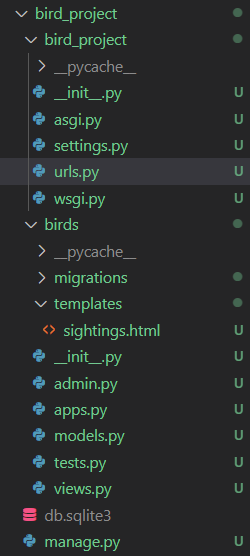

# ACS Demo 2023 - Python Masterclass II: Electric Coderoo
Hi there, it's me again - Oliver! I'm a developer and coding mentor, and I'm back with the ACS to deliver some more Django coding fun.


This repo contains a walkthrough of the content I'll be delivering in my *Python Masterclass II: Electric Coderoo* demo for the ACS in February 2023. The "What You Need" installation steps can be completed before the class if you want to be ready to race out of the gate!

You can also find the completed code in this repository, for you to compare to your own work if you run into bugs. Ready? Let's goooooooooooo!

---

## Table of Contents
- [ACS Demo 2023 - Python Masterclass II: Electric Coderoo](#acs-demo-2023---python-masterclass-ii-electric-coderoo)
  - [Table of Contents](#table-of-contents)
  - [What We Are Doing](#what-we-are-doing)
  - [What You Need](#what-you-need)
    - [Python 3](#python-3)
    - [VS Code](#vs-code)
    - [The Terminal](#the-terminal)
    - [PIP](#pip)
    - [Virtualenv](#virtualenv)
      - [On Windows:](#on-windows)
      - [On Mac:](#on-mac)
  - [Let's Talk Architecture!](#lets-talk-architecture)
  - [Information Flow](#information-flow)
  - [Start Coding Already!](#start-coding-already)
    - [Step 0. The Environment](#step-0-the-environment)
    - [Step 1: The Project](#step-1-the-project)
    - [Step 2: The Settings](#step-2-the-settings)
    - [Step 3: Migrating the Database (For The First Time)](#step-3-migrating-the-database-for-the-first-time)
    - [Step 4: Writing A Model](#step-4-writing-a-model)
    - [Step 5: Migrating The Database (Again)](#step-5-migrating-the-database-again)
    - [Step 6: Writing A Template](#step-6-writing-a-template)
    - [Step 7: Writing A View](#step-7-writing-a-view)
    - [Step 8: A Little Bit Of URL Housekeeping](#step-8-a-little-bit-of-url-housekeeping)
    - [Step 9: Go Look At A Bird](#step-9-go-look-at-a-bird)
    - [Step 10: Record Your Sighting](#step-10-record-your-sighting)
  - [Useful Resources:](#useful-resources)
    - [W3 Schools](#w3-schools)
    - [YouTube](#youtube)
    - [Django Info](#django-info)


---

## What We Are Doing
In our first masterclass (February 2022) we set up a simple static website - the kind of app that displays the same page every time a user visits it. 

In this extension masterclass, we will continue exploring the Python programming language by examining how Python’s Django library can be used to set up a **dynamic** website, which can update the information it displays based on interactions with users. We'll use the example of a birdwatching website, that lets users record their sightings of birds.

This will see us discussing:
* Data flow in a Django API
* Database design
* Models vs Serialisers
* Dynamic Views
* Dynamic Templating

By the end of our walkthrough we will have created customisable code which should allow each attendee to begin creating their own unique website; the kind of app that can be expanded into a portfolio project.

---

## What You Need
There are a few really useful tools you can use to get a little bit more out of this talk. You may have already encountered them, or may already be using them in your own coding adventure, but don't worry if you haven't. I'll be explaining everything we look at from the ground up. It also won't be a requirement to have or understand these tools to enjoy the talk - but they might make things a little more fun!

### [Python 3](https://wsvincent.com/install-python/)
Python 3 is the language I'll be discussing in the talk, so if you want to code along and try anything I demonstrate for yourself, you'll have it easier if you have it installed ahead of time! This link provides a good guide for installing it on any operating system. 

### [VS Code](https://code.visualstudio.com/download)
VS Code is an editor we'll be using to write code. You don't really need VS Code to program in Python - you can do it with another text editor like notepad, or even through the terminal if you want to. VS Code is a great tool to use, though, which will make a lot of things easier.

### [The Terminal](https://towardsdatascience.com/a-quick-guide-to-using-command-line-terminal-96815b97b955)
Some of the following links provide commands to run in the terminal for installing software, and during the presentation we will also be using the terminal to activate our code. You don't need to install anything to use this tool, but if you aren't familiar with it, this link explains a little about how to use it. Keep in mind that commands in the terminal are sometimes slightly different between Windows/Mac/Linux, so if you're experimenting with commands you learned about online, you may need to find instructions specific to your OS.

### [PIP](https://pip.pypa.io/en/stable/installation/)
PIP is a command-line tool for installing Python add-ons. Your Python installation should have come with PIP automatically, but this link will give you instructions on how to check if you have it, and how get it if you need. The code snippets in the linked webpage are intended to be run in the terminal.

### [Virtualenv](https://virtualenv.pypa.io/en/latest/index.html)
Virtualenv is a tool for managing Python add-ons - it lets you keep the tools you are using on a project organised and locked away, so that they don't clutter up the rest of your computer. I recommend using a new Virtualenv environment every single time you start a coding project. You can install it using PIP through the terminal:

#### On Windows:
```
py -m pip install virtualenv
```

#### On Mac:
```
python3 -m pip install virtualenv
```

---

## Let's Talk Architecture!
Last time we looked at Django, we didn't really need to talk much about the information flow in our project - we wrote a web page in HTML, gave it to Django, and Django made it available at a local address for us to access. This time things are a bit more complicated. We are planning to:
* Store information provided by our users
* Retrieve stored information and turn it into useable program objects
* Manipulate the information in our program logic
* Display the information in a pleasing layout

The number one way that we deal with complexity as programmers is by applying the **Single Responsibility Principle**. This is a rule that says (roughly) "every element of your project should have exactly one job". This means that we will be breaking our dynamic website up into multiple "chunks", each of which is responsible for approximately one of those dot-points! Check it out:


This architectural style is called the MVT paradigm, or Model-View-Template*. 

<small><small>* *You may have heard of a similar design philosophy before called MVC (Model-View-Controller) - if so, keep in mind that an MVT "template" is called a "view" in MVC, and an MVT "view" is called a "controller" in MVC. Confusing, I know.*</small></small> 

Each of these "chunks" will be one code file in our project. Luckily, Django will be handling the database for us, which means we just need to write Models, Templates, and Views. There are a few other files we will need to manipulate as we build the site, but they will be simple.

---

## Information Flow
With all these discrete chunks of code floating around, it's a good idea for us to take a quick look at what happens when a user accesses our site.

When a web browser navigates to a web-page, it sends a **request** to the server that hosts that site. The request describes what the user *wants* - maybe they're trying to see the page for the first time, or maybe they're trying to add a new bird sighting to the list.

Here's what it looks like when a user posts a new sighting to our website:


---

## Start Coding Already!

<hr style="border-style: dotted;" />

### Step 0. The Environment
Let's fire up the terminal and create an environment to work on our project in. First, let's create a directory to work in. Make sure it's in a sensible spot!

```
mkdir bird_project && cd bird_project
```

Next, we need to check we have Python's `virtualenv` library installed:

```
python3 -m pip install --upgrade virtualenv
```

Great, let's go ahead and use `virtualenv` to create a sandbox we can install all the other python modules we need. (This is better than installing them globally on your computer, because after a while with lots of projects you'll track of what modules each one needs.)

```
python3 -m virtualenv venv
```

Cool, here we chose the name `venv` for our virtual environment. Now let's activate it - you'll have to perform this step whenever you want to start a new session of work on the project.


```
# On Linux and Mac, the command is:
source venv/bin/activate

# On Windows, use:
venv/Scripts/activate
```

Perfect, now we can install Django:

```
pip install django
```

While we're here, we should take the time to start a `requirements.txt` file. This will let us keep track of the dependencies our project has:

```
pip freeze > requirements.txt
```

<hr style="border-style: dotted;" />

### Step 1: The Project

Setting up a blank Django project is as simple as one command:

```
django-admin startproject bird_project
```

We've chosen to call our project `bird_project`. Running this command will create a new folder containing all the boilerplate code required to make a basic Django project run.

A Django project can contain a number of "apps", which all work together to make your website/s work. We'll create just one. Let's call our app `birds`. First, navigate into the newly-created `bird_project` directory:

```
cd bird_project
```

Now, create the app:

```
python manage.py startapp birds
```

Now let's open our project in VS Code and see what we're working with!

```
code .
```


It might be confusing to have two folders called `bird_project`, one inside the other. There's a good reason for it, though. Our `birds` folder will contain all the files we need to make that particular app work. But a more complex project could have lots of apps, and lots of folders. On the other hand, there are some files that are required to make the whole project go, and we don't want them all floating around loose. For that reason, we have another folder for them, with the same name as the overall project.

<hr style="border-style: dotted;" />

### Step 2: The Settings

The first code we need to write involves a small change to the settings for our overal project. Open that "inner" `bird_project` folder in VS Code, and you'll find a file called `settings.py`. Scrolling through this file, you should find a section like this:

```python
INSTALLED_APPS = [
    'django.contrib.admin',
    'django.contrib.auth',
    'django.contrib.contenttypes',
    'django.contrib.sessions',
    'django.contrib.messages',
    'django.contrib.staticfiles',
]
```

We want to add one line right above that closing square bracket, like so:

```python
INSTALLED_APPS = [
    'django.contrib.admin',
    'django.contrib.auth',
    'django.contrib.contenttypes',
    'django.contrib.sessions',
    'django.contrib.messages',
    'django.contrib.staticfiles',
    'birds',
]
```

This registers the `birds` app we are writing, so that Django knows to include it when the code runs.

<hr style="border-style: dotted;" />

### Step 3: Migrating the Database (For The First Time)
We need to perform some initial setup of our database so that it is ready for us to start adding tables to. We can do this with a command in the terminal:

``` 
python manage.py migrate
```

Now we can check that everything is working by starting up the website for the first time:

```
python manage.py runserver
```

If all goes well you should see this:


<hr style="border-style: dotted;" />

### Step 4: Writing A Model
In VS Code, look for the `models.py` file in the `/birds` directory. Click on it, and let's enter some code:

```Python
from django.db import models
from django.forms import ModelForm

class BirdSighting(models.Model):
    SEX_CHOICES = [
        ('M', 'Male'),
        ('F', 'Female'),
        ('U', 'Unknown')
    ]
    AGE_CHOICES = [
        ('E', 'Egg'),
        ('H', 'Hatchling'),
        ('J', 'Juvenile'),
        ('A', 'Adult')
    ]
    
    species = models.CharField(max_length=100)
    sex = models.CharField(max_length=1, choices=SEX_CHOICES)
    age = models.CharField(max_length=1, choices=AGE_CHOICES)
    location = models.CharField(max_length=100)
    activity = models.CharField(max_length=100)
    spotter = models.CharField(max_length=100)
    date = models.DateField(auto_now_add=True)

class SightingForm(ModelForm):        
    class Meta: 
        model = BirdSighting
        exclude = ['date']
```

We'll talk through this during the session. What we're doing here is defining the properties of a "bird sighting" record, so that our app knows what kinds of info it will need to store in and retrieve from the database. We've also created a `ModelForm`, which will automatically generate an HTML form for us so that we don't need to spend time doing that.

<hr style="border-style: dotted;" />

### Step 5: Migrating The Database (Again)

That's right, we have to migrate the database once at the very start, and then once more every time we modify one of our models! 

A migration is really just "a change that needs to be applied to the database". Because we just defined a new type of data that needs to be stored, the database needs to be modified to include `BirdSighting` records.

Once again in the terminal, this time it's two commands:

```
python manage.py makemigrations
```
``` 
python manage.py migrate
```

<hr style="border-style: dotted;" />

### Step 6: Writing A Template

Back in VS Code, create a new directory inside the `/birds` directory, called `/templates`. 

Inside that directory, create a new file called `sightings.html`.

Your app structure probably looks something like this, now:




<small>Remember - you can just ignore `/img`, `.gitignore`, and `README.md` for now. You don't need them. </small>

Open that `sightings.html` file and let's add some `HTML` code!

```html
<!DOCTYPE html>
<html>
<head>
    <style>
        tr, th, td {
            border: 1px solid black;
        }
        th, td {
            width: 10%;
        }
        form, table {
            padding: 10px;
            width: 70%;
        }
    </style>
</head>
<body>

<h1>Add A Sighting</h1>
<form method="post" action="/sightings/">
    <table>
        {{ form }}
    </table>
    <input type="submit" value="Submit"/>
</form>

<h2>Previous Sightings</h2>
<table>
    <tr>
        <th>Bird</th>
        <th>Sex</th>
        <th>Age</th>
        <th>Location</th>
        <th>Activity</th>
        <th>Spotted By</th>
        <th>Date</th>
    </tr>
    
        <tr>
            <td>{{ sighting.species }}</td>
            <td>{{ sighting.sex }}</td>
            <td>{{ sighting.age }}</td>
            <td>{{ sighting.location }}</td>
            <td>{{ sighting.activity }}</td>
            <td>{{ sighting.spotter }}</td>
            <td>{{ sighting.date }}</td>
        </tr>
    
</table>

</body>
</html>

```

Mostly, this is normal `HTML` code. But the `HTML` experts among you might notice something unusual. There are some sections of the code enclosed in `` and `{{ }}` brackets! 

These are snippets of a templating language called `Jinja2`. When Django reads these, it knows to insert information into the template. 

<hr style="border-style: dotted;" />

### Step 7: Writing A View
We have a way to store and retrieve records now, and we have a way of presenting the info about them. What we need now is a way to give our users access to these resources.

In the `/birds` directory, there's a file called `views.py`. Let's open it and get editing!

```python
from django.http import HttpResponse
from django.template import loader
from .models import BirdSighting, SightingForm

def bird_sightings(request):
    if request.method == 'GET':
        my_bird_sightings = BirdSighting.objects.all().values()
        template = loader.get_template('sightings.html')
        page_data = {
            'sightings': my_bird_sightings,
            'form': SightingForm
        }
        return HttpResponse(template.render(page_data, request))
    
    if request.method=='POST':
        
        form=SightingForm(request.POST)
        if form.is_valid():
            sighting=form.save()

        my_bird_sightings = BirdSighting.objects.all().values()
        template = loader.get_template('sightings.html')
        page_data = {
            'sightings': my_bird_sightings,
            'form': SightingForm
        }
        return HttpResponse(template.render(page_data, request))
```

<hr style="border-style: dotted;" />

### Step 8: A Little Bit Of URL Housekeeping
If we want our users to be able to access this view, we need to register it to some URL. For now, we are still in the development phase of our website, so we won't make it available on the public web. But we can still define an address for it locally. Open the `urls.py` file in `/bird_project/bird_project`. We are making two changes - one extra `import`, and one extra `path()`:

```python
from django.contrib import admin
from django.urls import path
from birds.views import bird_sightings

urlpatterns = [
    path('admin/', admin.site.urls),
    path('sightings/', bird_sightings),
]
```

<hr style="border-style: dotted;" />

### Step 9: Go Look At A Bird
Go on, what are you waiting for?

<hr style="border-style: dotted;" />

### Step 10: Record Your Sighting
Behold - a functional website!!


---

## Useful Resources:
Don't forget - it's also totally ok to Google any questions you have. Experts do this all the time! There's a forum called Stack Overflow which is a great place to find answers.

### W3 Schools
These three tutorials are a great resource for starting out if you like learning by reading and then doing. 
* [Explainer on The CLI](https://www.w3schools.com/whatis/whatis_cli.asp)
* [Python Tutorial](https://www.w3schools.com/python/default.asp)
* [Git Tutorial](https://www.w3schools.com/git/) (My advice: select GitHub as your remote repository platform if you're learning for the first time.)

### YouTube
These videos give a decent overview if you prefer to watch and learn. The Python Tutorial is long, so watch the others first before diving into it!
* [Jesse Showalter - How To Use The Command Line (Mac)](https://youtu.be/5XgBd6rjuDQ)
* [The New Boston - Windows Command Line Tutorial](https://youtu.be/MBBWVgE0ewk)
* [FreeCodeCamp - Learn Python](https://youtu.be/rfscVS0vtbw)
* [Colt Steele - Learn Git in 15 Minutes](https://youtu.be/USjZcfj8yxE)

### Django Info
Once you have a bit of a handle on Python, these Django resources are a great way to progress into making websites.
* [Django Official Website - Writing Your First Django App](https://docs.djangoproject.com/en/4.0/intro/tutorial01/)
* [Django Girls - Django Girls Tutorial](https://tutorial.djangogirls.org/en/)
* (Youtube) [FreeCodeCamp - Python Django Framework](https://youtu.be/F5mRW0jo-U4)